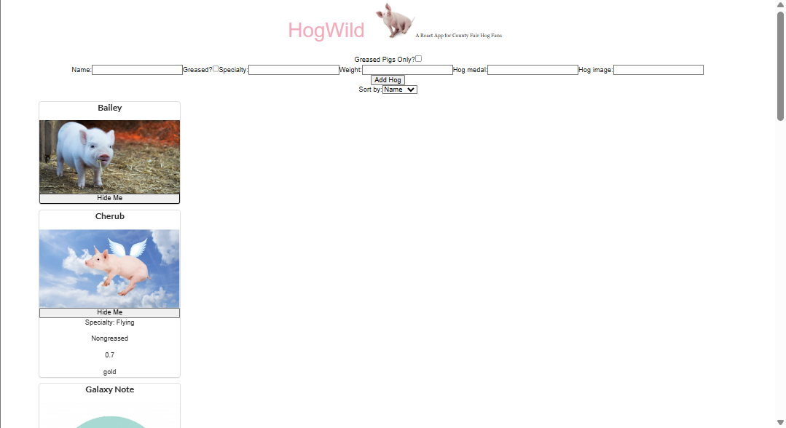

# Hogwild React App

## Overview

Hogwild is a React application for displaying and managing prize-winning pigs entered in a county fair competition.

Users can:

- View all hogs
- Expand cards to see additional details
- Filter greased hogs
- Sort hogs by name or weight
- Hide hogs from view
- Add new hogs through a form

This project demonstrates core React concepts including:

- Component-based architecture
- Props
- State management with `useState`
- Event handling
- Conditional rendering
- Controlled forms
- Parent/child component communication
- Accessibility best practices

---

# Features

## Display Hog Cards

- Renders all hogs from `porkers_data.js`
- Displays:
  - Hog name
  - Hog image

## Expandable Details

Clicking a hog card reveals:

- Specialty
- Weight
- Greased status
- Highest medal achieved

## Hide Hogs

Each card contains a `"Hide Me"` button that removes the hog from view without deleting the original data.

## Greased Filter

Users can filter the displayed hogs to show only greased pigs using a checkbox filter.

## Sorting

Users can sort hogs:

- Alphabetically by name
- Numerically by weight

## Add New Hogs

A controlled React form allows users to add new hogs dynamically.

---

# Technologies Used

- React
- JavaScript (ES6+)
- Semantic UI
- React Testing Library
- CSS

---

# Project Structure

```txt
src/
│
├── components/
│   ├── App.jsx
│   ├── HogCard.jsx
│   ├── HogForm.jsx
│   └── Nav.jsx
│
├── porkers_data.js
│
└── __tests__/
    └── App.test.jsx
```

---

# React Concepts Practiced

## State Management

### App.jsx

Global/shared state:

- `hogs`
- `greasedOnly`
- `sortBy`

### HogCard.jsx

Local UI state:

- `showDetails`

### HogForm.jsx

Controlled form input state:

- `name`
- `specialty`
- `weight`
- `greased`
- `medal`
- `image`

---

# Key Patterns Used

## Conditional Rendering

```jsx
{showDetails && (
  <div>
    ...
  </div>
)}
```

## Controlled Inputs

```jsx
<input
  value={name}
  onChange={(e) => setName(e.target.value)}
/>
```

## Checkbox Handling

```jsx
<input
  type="checkbox"
  checked={greased}
  onChange={(e) => setGreased(e.target.checked)}
/>
```

## Sorting Without Mutating State

```jsx
[...displayedHogs].sort((a, b) =>
  a.name.localeCompare(b.name)
)
```

## Updating Array State

### Add Item

```jsx
setHogs([...hogs, newHog])
```

### Remove Item

```jsx
setHogs(
  hogs.filter(hog => hog.name !== hogName)
)
```

---

# Accessibility

This project includes:

- Semantic labels using `htmlFor`
- Accessible image alt text
- `aria-label="hog card"` for testing and accessibility

---

# Screenshot



---

# Running the Project

## Install Dependencies

```bash
npm install
```

## Start Development Server

```bash
npm start
```

## Run Tests

```bash
npm test
```

---

# Lessons Learned

This project reinforced:

- Lifting state up
- Inverse data flow
- Controlled components
- React event handling
- Array manipulation in state
- Separating concerns between components
- Reading and debugging test suites

---
# Author

Created by Matthew Swanberg as part of a lab for course 4 mod 7.